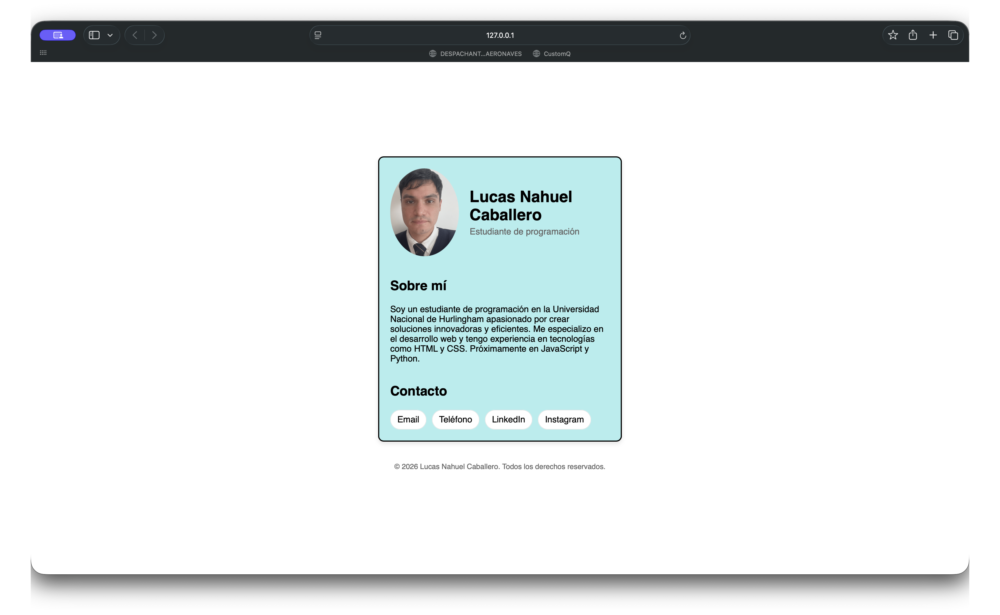
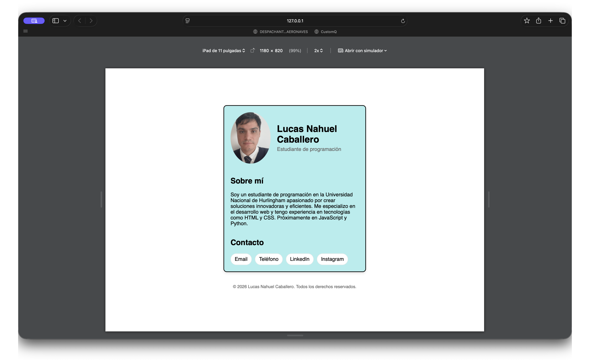
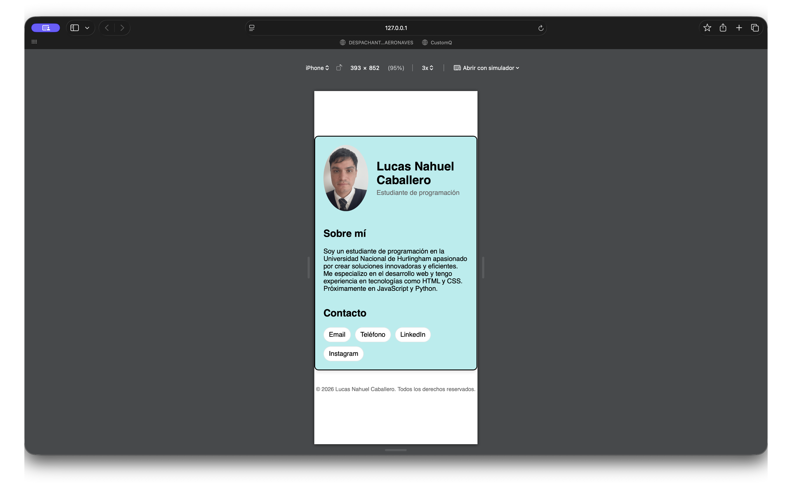

# Tarjeta de Presentación Personal

## Descripción
Proyecto desarrollado con HTML5 y CSS3 para presentar información personal de manera clara y atractiva. Incluye fotografía de perfil, información profesional, una breve descripción y enlaces de contacto.

## Tecnologías
- HTML5
- CSS3

## Características
- Estructura semántica.
- Diseño responsive.
- Botones de contacto.
- Estilos personalizados mediante CSS.

## Capturas

### Vista de escritorio

### Vista móvil

## Demo
[Link a GitHub Pages](https://lucaballero1995-ux.github.io/tarjeta-presentacion-personal/)

## Autor
Lucas Nahuel Caballero